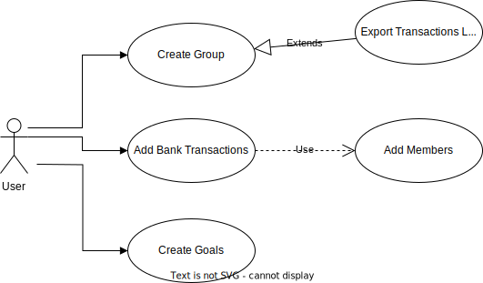

# Briefing **Porkin** - Sistema de Gestão Financeira Coletiva 
**Projeto:** Porkin - Controle de gestão financeira coletiva.  

**Membros:** Felipe dos Santos Bento, Lauri Ellen Santinelli Biral e Mariana Parducci. 

**Tecnologia Front End:** React Native.  

**Tecnologias Back End:** Java, Ruby on Rails. 

## Resumo Sistema de Gestão Financeira Coletiva:

O aplicativo Porkin foi desenvolvido para simplificar o controle financeiro compartilhado em residências. Com esta plataforma, os usuários podem facilmente administrar as finanças coletivas do lar de forma eficiente. Iniciar a gestão é simples: um membro do grupo cria uma unidade familiar e pode adicionar até três integrantes gratuitamente. Cada participante obtém sua própria seção para administrar suas finanças pessoais, a qual também é acessível aos outros membros do grupo. Notificações bancárias das transações realizadas por qualquer usuário são lidas e ele poderá escolher se deseja ou não adicionar o valor no registro coletivo.  

Uma característica fundamental do Porkin é a capacidade de categorizar cada transação. Por exemplo, um gasto de R$15 em um Pet Shop pode ser devidamente categorizado, tornando mais claro o destino dos recursos. Ao acumular informações de compra e venda, o aplicativo proporciona uma visão aprofundada das despesas de cada membro e do grupo como um todo. Essa abordagem auxilia a identificar padrões de gastos e oportunidades de economia. 

Para a análise geral, o aplicativo apresenta uma aba dedicada ao extrato das transações do grupo, promovendo uma visão panorâmica e abrangente das finanças coletivas. Através dessa funcionalidade, os usuários podem monitorar o fluxo de dinheiro de maneira mais ampla e tomar decisões informadas para a gestão financeira geral do lar.  

* **Público Alvo:** 

O Porkin é direcionado a famílias e grupos residenciais que desejam otimizar seu controle financeiro coletivo. Ele é especialmente útil para famílias numerosas, casas compartilhadas, e grupos que buscam manter um registro organizado das despesas conjuntas. 

* **Principais Dores Resolvidas pelo Projeto:** 

    1- Desafio no Controle Financeiro Coletivo:  O projeto atende à necessidade de famílias e grupos residenciais que enfrentam dificuldades na administração de finanças compartilhadas. Com o Porkin, as complexidades do gerenciamento conjunto são simplificadas. 

    2- Falta de Transparência: Muitas vezes, a falta de clareza nas transações e gastos compartilhados pode gerar conflitos. O aplicativo resolve esse problema ao permitir a categorização detalhada das transações, garantindo uma visão transparente das despesas. 

    3- Conflitos de comunicação: Com dados claros e a opção de adicionar transações no registro coletivo, o aplicativo ajuda a prevenir conflitos resultantes de despesas não comunicadas ou mal compreendidas. 

    4- Monitoramento Simplificado: A funcionalidade de extrato das transações oferece uma visão geral e panorâmica das finanças coletivas, facilitando o monitoramento do fluxo de dinheiro e permitindo ajustes conforme necessário. 

    Em síntese, o Porkin é uma ferramenta eficaz para aliviar os desafios do controle financeiro compartilhado, oferecendo uma abordagem estruturada e transparente para gerenciar as finanças de famílias e grupos residenciais.

* **Formas de Monetização:**  

    * Possibilidade de adicionar mais de 4 membros: Pagamento de Taxa 

    * Possibilidade de remover anúncios: Assinatura Mensal. 

## Requisitos da primeira versão (MVP): 

* Os usuários devem ser capazes de criar contas de usuário com informações básicas, como nome e senha. 

* Usuários podem registrar suas despesas pessoais, incluindo o valor da despesa, categoria e descrição. 

* O aplicativo disponibiliza uma lista de despesas pré-definidas, como planos de assinaturas de streaming e outros serviços, que os usuários podem selecionar em vez de digitar manualmente os valores. Isso simplifica o processo de registro de despesas e agiliza a inserção de informações financeiras.  

* Os usuários podem criar grupos personalizados, definindo um nome e uma descrição para o grupo. 

    * Os usuários podem adicionar outros membros ao grupo, convidando-os através de e-mail ou nome de usuário. 

    * Quando um membro registra uma despesa, ele tem a possibilidade de compartilhar com o grupo para acompanhamento. 

* Permitir que os usuários definam níveis de acesso aos detalhes dos gastos e outros membros do grupo.

* Criar uma interface simples e fácil de usar, com design responsivo para dispositivos móveis.

* Enviar notificações quando novos gastos forem registrados ou houver atualizações importantes no grupo.

* O aplicativo se integra às APIs dos bancos para receber notificações de transações financeiras, como compras, transferências e pagamentos. 

    * O aplicativo lê as notificações recebidas do banco e identifica as informações relevantes, como valor, data, categoria de gasto e descrição. 

* Os pais ou responsáveis podem criar **perfis Kids** vinculados às suas contas de usuário.

    * O perfil Kids possui uma interface visualmente atrativa e adaptada para crianças.

    * As crianças podem definir metas simples de economia para itens que desejam comprar no futuro.

    * Conforme as crianças atingem metas de economia ou completam atividades, elas ganham recompensas virtuais.

    * O perfil Kids tem acesso restrito a determinadas funcionalidades, impedindo ações que possam comprometer as finanças.

    * Os pais têm acesso a um painel para visualizar as atividades do perfil Kids, incentivando interações e acompanhamento.

    * **Gamificação:** Os jogos e recompensas incentivam a participação ativa das crianças na aprendizagem financeira.

    ## Diagramas:
    ### Casos de uso:

    

